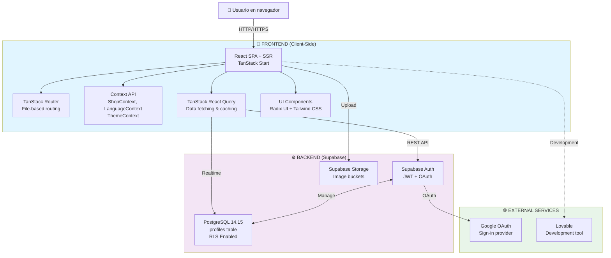
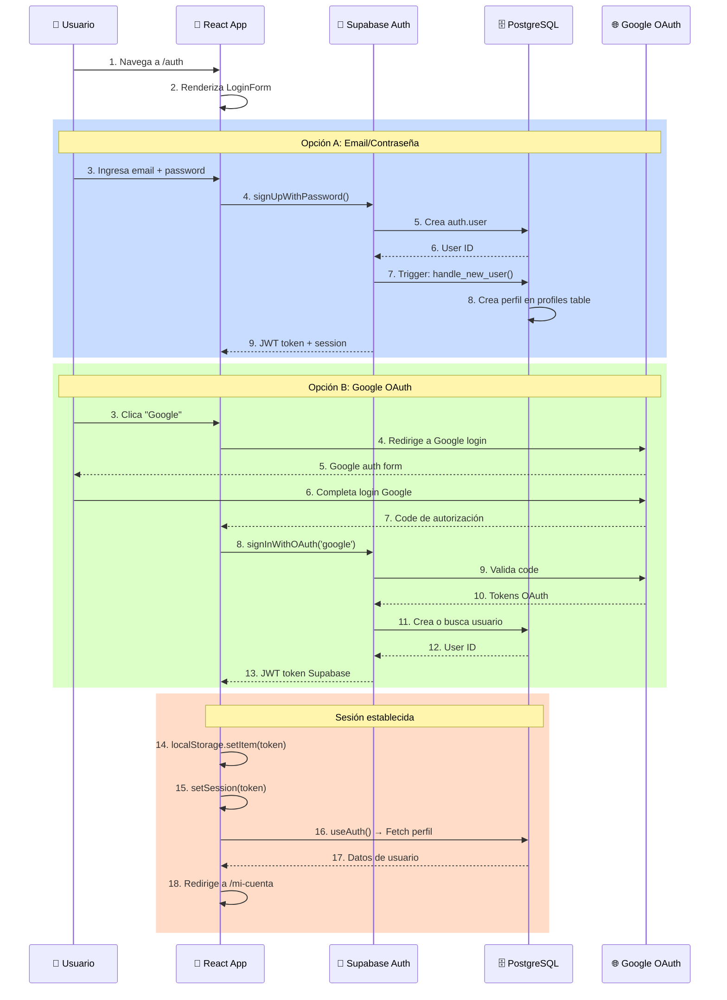
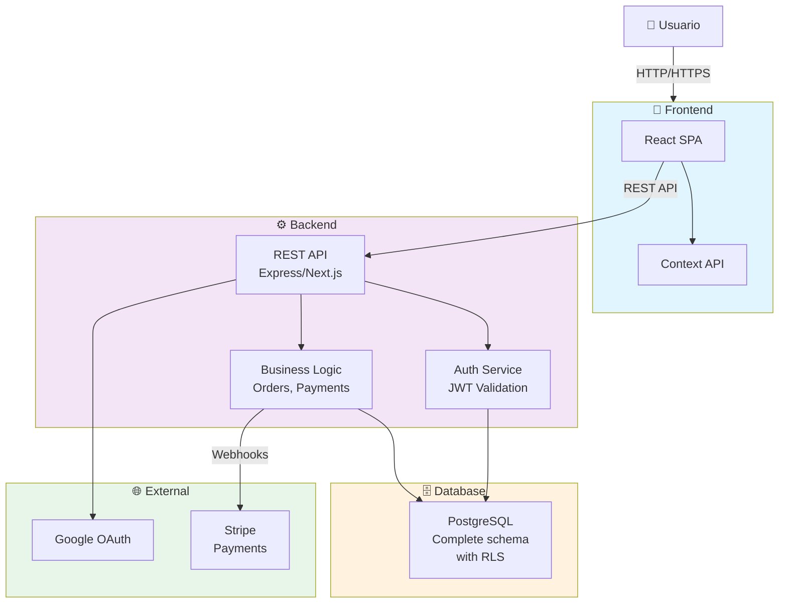

# ARCHITECTURE

## Documentación de Arquitectura del Proyecto

> Este documento debe generarse siguiendo `PROJECT_AUDIT_SPEC.md`.
> No modifica el proyecto. Documenta la arquitectura actual y la arquitectura recomendada.

---

# OBJETIVO

Documentar la arquitectura completa de floristeria lucia explicando cómo está construido el proyecto desde el punto de vista técnico y de flujo de datos.

**Preguntas respondidas:**

- ¿Dónde vive el frontend? React + TanStack Start en Vercel (probable)
- ¿Dónde vive el backend? Supabase (PostgreSQL + Auth)
- ¿Dónde está la base de datos? Supabase PostgreSQL
- ¿Qué servicios externos existen? Supabase, Google OAuth, Lovable
- ¿Cómo viajan los datos? HTTP/HTTPS REST + realtime (Supabase)
- ¿Cómo se autentican los usuarios? Supabase Auth + JWT
- ¿Cómo funciona el carrito? Context API + localStorage
- ¿Cómo llegan los pagos? No implementado - contacto manual
- ¿Cómo se despliega la aplicación? GitHub → Vercel (presumido)

---

# REGLAS

1. No inventar arquitectura.
2. Diferenciar siempre ACTUAL y RECOMENDADA.
3. Basarse únicamente en el código encontrado.
4. Los diagramas deben realizarse en Mermaid.
5. Nunca asumir tecnologías inexistentes.

---

# 1. RESUMEN DE ARQUITECTURA

**Tipo de aplicación:** E-commerce de flores (tienda en línea)

**Arquitectura:** Arquitectura separada frontend/backend (decoupled)

- **Frontend:** SPA + SSR con TanStack Start + React
- **Backend:** BaaS (Backend as a Service) con Supabase

**Patrón arquitectónico:**

- Frontend: Component-based con Context API para estado
- Backend: Serverless con PostgreSQL y row-level security

**Tecnologías principales:**

- Frontend: React 19, TypeScript, Tailwind CSS, Radix UI
- Backend: Supabase (PostgreSQL 14.15), Auth, Storage
- Herramientas: Vite, TanStack Start, TanStack Router, TanStack Query

**Estado actual:** MVP en desarrollo, catálogo funcional, carrito básico, sin pagos

---

# 2. ARQUITECTURA ACTUAL

## 2.1 Vista general

La arquitectación actual es una arquitectura moderna desacoplada donde:

**Frontend (React):**

- Aplicación React con SSR (Server-Side Rendering)
- Estado global vía Context API
- Enrutamiento con TanStack Router
- Gestión de datos con TanStack React Query
- Estilos con Tailwind CSS

**Backend (Supabase):**

- PostgreSQL como base de datos relacional
- Supabase Auth para autenticación
- Row Level Security (RLS) para control de acceso
- Storage para imágenes

**Servicios externos:**

- Google OAuth para autenticación social
- Lovable para desarrollo y generación de código

## 2.2 Diagrama de arquitectura general



## 2.3 Responsabilidades por capa

| Capa             | Tecnología              | Responsabilidad                             |
| ---------------- | ----------------------- | ------------------------------------------- |
| Presentación     | React 19 + TypeScript   | Renderizar UI, capturar entrada usuario     |
| Enrutamiento     | TanStack Router         | Navegar entre páginas, parámetros dinámicos |
| Estado           | Context API             | Carrito, favoritos, idioma, tema            |
| Data Fetching    | TanStack React Query    | Cachear datos, sincronizar con servidor     |
| Estilos          | Tailwind CSS + Radix UI | Componentes accesibles, responsive          |
| Autenticación    | Supabase Auth           | JWT, OAuth, gestión de sesiones             |
| Base de datos    | PostgreSQL + RLS        | Persistencia de perfiles, control de acceso |
| Almacenamiento   | Supabase Storage        | Imágenes y assets                           |
| Hosting Frontend | Vercel (presumido)      | SSR, edge functions, CDN                    |
| Hosting Backend  | Supabase Cloud          | Serverless PostgreSQL, Auth                 |

---

### 2.3 Responsabilidades por capa

Crear una tabla:

| Capa     | Tecnología | Responsabilidad |
| -------- | ---------- | --------------- |
| Frontend |            |                 |
| Backend  |            |                 |
| Database |            |                 |
| Auth     |            |                 |
| Storage  |            |                 |
| Payments |            |                 |

---

## 3. ESTRUCTURA LÓGICA

Capas del proyecto:

### Capa de Presentación

Componentes React reutilizables:

- Componentes UI (Button, Input, Form, etc.)
- Componentes de negocio (ProductCard, CartDrawer, Navbar)
- Páginas (rutas)

### Capa de Aplicación

Lógica de negocio:

- Contextos (ShopContext, LanguageContext, ThemeContext)
- Hooks (useAuth, useShop, useLanguage)
- Utilidades (formatPrice, cn, translate)

### Capa de Datos

Persistencia:

- localStorage (carrito, favoritos, idioma)
- Supabase (perfiles de usuario)
- Datos estáticos (catálogo, servicios)

### Capa de Infraestructura

Servicios cloud y despliegue:

- Supabase Cloud (BD, Auth, Storage)
- Google Cloud (OAuth)
- Hosting Frontend (Vercel presumido)

---

## 4. FLUJO COMPLETO DE DATOS

### Flujo: Registro de usuario

```
Usuario completa form en /auth
         ↓
React submite con supabase.auth.signUp(email, password)
         ↓
Supabase Auth crea usuario en auth.users
         ↓
Trigger on_auth_user_created dispara
         ↓
Función handle_new_user() crea perfil en profiles
         ↓
Frontend recibe JWT token
         ↓
sesión almacenada localmente
         ↓
Redirige a /mi-cuenta
```

### Flujo: Inicio de sesión

```
Usuario completa form en /auth
         ↓
React submite con supabase.auth.signInWithPassword()
         ↓
Supabase Auth valida credenciales
         ↓
Si correcto: genera JWT token
         ↓
Frontend almacena token
         ↓
useAuth() actualiza estado de sesión
         ↓
Componentes protegidos se renderizan
```

### Flujo: Visualizar catálogo

```
Usuario navega a /catalogo
         ↓
Componente CatalogPage renderiza
         ↓
ShopContext proporciona favorites state
         ↓
productos array cargado de catalog.ts (estático)
         ↓
Se filtran por categoría si existe
         ↓
Se buscan por query string si existe
         ↓
ProductCard renderiza cada producto
         ↓
Usuario ve UI con imágenes y precios
```

### Flujo: Añadir al carrito

```
Usuario clica "Añadir al carrito" en ProductCard
         ↓
useShop().addLine() se invoca
         ↓
CartLine se añade a estado de ShopContext
         ↓
useEffect sincroniza con localStorage
         ↓
CartDrawer se abre automáticamente
         ↓
Usuario ve confirmación visual
```

### Flujo: Contactar para pedir

```
Usuario clica "Contactar" en /carrito
         ↓
Navega a /contacto o clica WhatsApp
         ↓
Se abre:
  - Formulario /contacto (email)
  - WhatsApp: +34919953880
  - Teléfono: 919 95 38 80
         ↓
Floristería recibe contacto manualmente
         ↓
Confirma pedido y método de pago
         ↓
Cliente paga (transferencia, tarjeta, PayPal)
         ↓
Floristería prepara y entrega
```

---

## 5. ARQUITECTURA DE SERVICIOS

| Servicio         | Función              | Datos                        | Comunicación        |
| ---------------- | -------------------- | ---------------------------- | ------------------- |
| **Supabase**     | BD, Auth, Storage    | Usuarios, perfiles, imágenes | REST API + Realtime |
| **Google OAuth** | Autenticación social | Email, nombre                | OAuth 2.0           |
| **Lovable**      | Desarrollo asistido  | Código y generación          | Web interface       |

**Supabase en detalle:**

- PostgreSQL para base de datos relacional
- Supabase Auth para gestión de usuarios
- JWT tokens para autenticación
- RLS para control de acceso a nivel de BD
- Storage para imágenes en buckets

---

## 6. APIs Y COMUNICACIÓN

### Frontend → Backend (Supabase)

**Protocolo:** HTTPS REST + WebSocket Realtime
**Autenticación:** JWT Bearer token en headers
**Formato:** JSON request/response

**Ejemplos de llamadas:**

```javascript
// Lectura
const { data } = await supabase.from("profiles").select("*").eq("id", userId);

// Escritura
const { error } = await supabase.from("profiles").upsert({ id: userId, full_name, phone });

// Auth
const { error } = await supabase.auth.signUp({ email, password });
```

### Backend (Supabase) → Database (PostgreSQL)

**Interfaz:** Supabase query API (abstracción de SQL)
**Seguridad:** RLS policies en cada tabla
**Validación:** Constraints a nivel de BD

**No hay ORM, se usa Supabase SDK que genera SQL internamente.**

### Backend → Servicios externos

**Google OAuth:**

- Flujo OAuth 2.0 estándar
- Redirect URI: `{app-url}/auth/callback`
- Credenciales: Client ID (público) + Secret (privado en servidor)

**Lovable:**

- No hay comunicación runtime (solo en desarrollo)
- Integración vía sincronización de código

---

## 7. AUTENTICACIÓN ARQUITECTÓNICA

Flujo completo de autenticación:



**Componentes principales:**

- **useAuth()** hook - Obtiene sesión actual
- **Supabase Auth** - Gestiona JWT y refresh
- **RLS Policies** - Asegura acceso solo a datos propios
- **LocalStorage** - Mantiene token en cliente

---

## 8. PERSISTENCIA

Dónde se guarda cada tipo de información:

| Información           | Ubicación             | Persistencia      | Sincronización      |
| --------------------- | --------------------- | ----------------- | ------------------- |
| Usuarios              | auth.users (Supabase) | Permanente        | Automática          |
| Perfiles              | profiles (PostgreSQL) | Permanente        | Automática          |
| Carrito               | localStorage          | Sesión/Permanente | Manual (useEffect)  |
| Favoritos             | localStorage          | Permanente        | Manual (useEffect)  |
| Sesión/Token          | localStorage/cookies  | Sesión            | Supabase automática |
| Preferencias (idioma) | localStorage          | Permanente        | Manual (useEffect)  |
| Productos             | catalog.ts (código)   | N/A               | Requiere re-deploy  |
| Imágenes/assets       | Supabase Storage      | Permanente        | CDN                 |

**Nota:** Los datos de carrito, favoritos e idioma están en localStorage sin sincronización con BD. Si usuario se registra, estos datos no se recuperan en otro dispositivo.

---

## 9. EVENTOS DEL SISTEMA

Eventos importantes detectados:

| Evento              | Disparador          | Acción                                          |
| ------------------- | ------------------- | ----------------------------------------------- |
| Usuario registrado  | auth.users INSERT   | Trigger crea perfil automáticamente             |
| Login completado    | signIn() llamada    | Sesión establecida, Redux state actualizado     |
| Carrito actualizado | addLine(), setQty() | localStorage sincroniza                         |
| Idioma cambiado     | setLanguage()       | localStorage sincroniza, HTML lang se actualiza |

**Nota:** No hay eventos de pedidos, pagos o inventario porque no están implementados.

---

## 10. DEPLOYMENT

Flujo de despliegue presumido (basado en tech stack):

```
Desarrollador pushea a GitHub
        ↓
Vercel recibe webhook (presumido)
        ↓
npm ci && npm run build
        ↓
Vite builds bundle + SSR
        ↓
Nitro generates server bundle
        ↓
Vercel deploya a edge + funciones
        ↓
DNS apunta a Vercel CDN
        ↓
HTTPS/SSL automático (Let's Encrypt)
        ↓
App disponible en producción
```

**Build:**

- `npm run build` ejecuta Vite
- Output: `.output/` con bundles de client + server
- Tamaño aproximado: no determinado

**Variables:**

- VITE_SUPABASE_URL → env file Vercel
- VITE_SUPABASE_ANON_KEY → env file Vercel
- VITE_GOOGLE_CLIENT_ID → env file Vercel

**Dominio:**

- No determinado (presumido: floristerialuciamotrico.com o similar)
- DNS debe apuntar a Vercel

**SSL:**

- Automático vía Vercel (Let's Encrypt)

---

## 11. ARQUITECTURA RECOMENDADA

Esta sección describe mejoras sugeridas para escalabilidad y mantenimiento.

### Objetivos

✓ **Escalabilidad** - Permitir crecer sin reescribir
✓ **Seguridad** - Validación y autorización en servidor
✓ **Mantenibilidad** - Código limpio, tests, CI/CD
✓ **Rendimiento** - Optimizaciones de carga y ejecución

### Cambios recomendados

**1. Agregar capa Backend REST propia**

- Express.js o Next.js API Routes
- Validar precios en servidor
- Gestionar órdenes y pagos
- Rate limiting

**2. Persistencia completa en BD**

- Tabla: orders (pedidos)
- Tabla: order_items (ítems del pedido)
- Tabla: addresses (direcciones de usuario)
- Tabla: products (catálogo dinámico)
- Tabla: cart_items (carrito persisted)

**3. Sistema de pagos**

- Stripe integration
- Webhooks para confirmación
- Validación de transacciones

**4. Admin Dashboard**

- CRUD de productos
- Gestión de órdenes
- Estadísticas de ventas
- Usuarios y roles

**5. CI/CD + Testing**

- GitHub Actions para testing
- Linting automático
- E2E tests con Playwright
- Deploy automático a staging

### Diagrama recomendado



---

## 12. DECISIONES DE ARQUITECTURA

### Decisión 1: Frontend-heavy con BaaS backend

**Contexto** - Proyecto construido por Lovable (IA code generation), preferencia por simplicidad inicial

**Problema** - Sin servidor propio, difícil validar lógica crítica como precios

**Solución** - Usar Supabase para BD y Auth, mantener lógica en cliente

**Impacto** - ✓ Rápido development, ✗ Difícil escalar, requiere rewrite para pagos

### Decisión 2: Catálogo hardcodeado en TypeScript

**Contexto** - MVP rápido, pocos productos

**Problema** - No se pueden actualizar sin cambiar código y re-deploy

**Solución** - Array estático en catalog.ts, fácil de modificar en código

**Impacto** - ✓ Simple para MVP, ✗ No escala, necesita BD dinámicamente

### Decisión 3: Carrito en localStorage sin servidor

**Contexto** - Enfoque de MVP, sin pago integrado

**Problema** - Carrito se pierde entre dispositivos

**Solución** - Persistencia local, contacto manual para pedidos

**Impacto** - ✓ Rápido implementar, ✗ Pobre UX, requiere BD para producción

---

## 13. RIESGOS ARQUITECTÓNICOS

### 🔴 Críticos

- **Sin validación de precios en servidor** - Atacante puede modificar before checkout
- **Sin persistencia de carrito en BD** - Usuario pierde carrito si limpia localStorage
- **Sin API de pagos** - Imposible vender completamente en línea

### 🟠 Altos

- **Supabase anon key expuesta** - RLS debe proteger, pero si RLS falla, todo accesible
- **Catálogo hardcodeado** - No se puede actualizar sin re-deploy
- **Sin CI/CD** - Manual deployments = riesgo humano

### 🟡 Medios

- **Sin tests automatizados** - Cambios pueden romper cosas
- **SSR overhead** - TanStack Start agrega complejidad en servidor
- **CORS origen abierto** - Si está así, cualquiera puede llamar APIs

### 🟢 Bajos

- **Bundle size** - 30+ componentes Radix pueden inflar output
- **Token refresh** - Supabase maneja, pero revisar timeout
- **Imágenes sin optimizar** - CDN debería comprimir automáticamente

---

## 14. CONCLUSIÓN

### Qué está bien diseñado

✓ Stack moderno y apropiado (React 19, TypeScript, Tailwind, Radix)
✓ RLS en Supabase protege datos de usuario
✓ Componentes accesibles y responsive
✓ Autenticación social (Google OAuth)
✓ Internacionalización en 3 idiomas
✓ Estado limpio con Context API

### Qué necesita refactor

✗ Separar lógica de negocio (crear API REST)
✗ Persistencia de carrito en BD
✗ Catálogo dinámico (mover a BD)
✗ Validación de precios en servidor
✗ Agregrar tests automatizados

### Qué puede escalar

✓ Supabase puede escalar verticalmente
✓ Frontend en Vercel es scalable (edge functions)
✓ RLS permite multi-tenancy
✓ Context API → Redux si necesita más complejidad

### Qué debe mantenerse

✓ Componentes Radix UI base (core)
✓ estructura de rutas (file-based con TanStack)
✓ Autenticación con Supabase Auth
✓ Styling con Tailwind (consistencia)

### Qué no debe modificarse sin análisis de dependencias

⚠️ Schema de Supabase (afecta RLS y triggers)
⚠️ Estructura de carpetas src/ (muchas importaciones)
⚠️ Variables de entorno (Supabase keys)
⚠️ Middleware de autenticación en __root.tsx

---

**Documento completado:** Cualquier desarrollador puede entender la arquitectura sin leer el código fuente.

**Siguiente paso:** Implementar sistema de pagos y órdenes para pasar a producción.

---

Parte de la suite de auditoría:

- PROJECT_AUDIT_SPEC.md (metodología)
- PROJECT_AUDIT_REPORT.md (auditoría completa)
- ARCHITECTURE.md (este documento)
- DATABASE.md (modelo de datos)
- SECURITY.md (análisis de seguridad)
