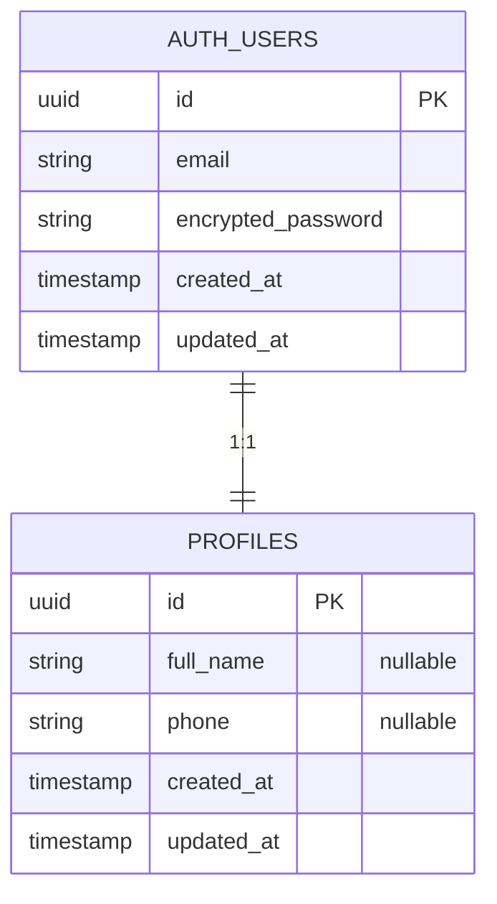
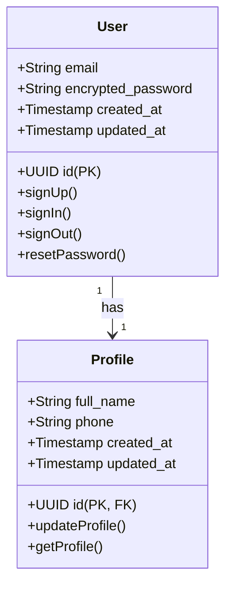

# DATABASE

## Documentación Completa del Modelo de Datos

> Este documento debe generarse siguiendo `PROJECT_AUDIT_SPEC.md`.
> No modifica la base de datos. Su única función es reconstruir y documentar el modelo de datos existente.

**Estado:** Completado
**Fecha:** 2026-08-26

---

# OBJETIVO

Este documento debe permitir comprender completamente la estructura de datos del proyecto sin necesidad de abrir la base de datos ni leer las migraciones manualmente.

Debe reconstruir:

- Tablas
- Columnas
- Tipos de datos
- Primary Keys
- Foreign Keys
- Relaciones
- Índices
- Constraints
- Enums
- Views
- Functions
- Triggers
- Policies
- RLS
- Migraciones
- Seeds
- Flujo de datos

**Nunca inventes entidades.**

Si algo no existe o no puede determinarse, escribe:

> No determinado a partir del código analizado.

---

# REGLAS

1. No crear tablas nuevas.
2. No modificar migraciones.
3. No asumir relaciones.
4. No completar columnas inexistentes.
5. Basarse únicamente en el código, SQL y migraciones.
6. Los diagramas deben utilizar Mermaid.
7. Diferenciar siempre entre estructura encontrada y recomendaciones futuras.

---

# CONTENIDO

# 1. RESUMEN DEL MODELO DE DATOS

## Base de datos detectada

| Campo       | Valor                                       |
| ----------- | ------------------------------------------- |
| Motor       | PostgreSQL 14.15 (Supabase)                 |
| ORM         | Supabase SDK (no hay ORM, queries directas) |
| Migraciones | Sí - 3 migraciones en supabase/migrations/  |
| Seeds       | No detectados                               |
| RLS         | Habilitado en todas las tablas              |
| Storage     | Sí - Bucket 'hero-animation'                |

## Número de entidades

| Elemento  | Cantidad                                             |
| --------- | ---------------------------------------------------- |
| Tablas    | 1 (public.profiles)                                  |
| Views     | 0                                                    |
| Functions | 2 (update_updated_at_column, handle_new_user)        |
| Triggers  | 2 (update_profiles_updated_at, on_auth_user_created) |
| Policies  | 3 (SELECT, INSERT, UPDATE en profiles)               |

---

# 2. INVENTARIO DE TABLAS

| Tabla           | Descripción                             | Registros estimados                  |
| --------------- | --------------------------------------- | ------------------------------------ |
| auth.users      | Usuarios del sistema (Supabase managed) | Variable, según usuarios registrados |
| public.profiles | Perfil extendido de usuario             | Igual a auth.users                   |
| storage.objects | Objetos en buckets de almacenamiento    | Imágenes de la aplicación            |

**Total de tablas de negocio:** 1 (profiles)
**Total de tablas de sistema:** 2 (auth.users, storage.objects)

---

# 3. DOCUMENTACIÓN DE CADA TABLA

### Tabla: `public.profiles`

#### Descripción

Extensión del usuario autenticado. Almacena información adicional del perfil que no es manejo por Supabase Auth. Se crea automáticamente cuando un usuario se registra.

#### Columnas

| Campo      | Tipo                     | PK  | FK           | Nullable | Default | Descripción                              |
| ---------- | ------------------------ | --- | ------------ | -------- | ------- | ---------------------------------------- |
| id         | UUID                     | ✓   | ✓ auth.users | ✗        | -       | ID del usuario (referencia a auth.users) |
| full_name  | TEXT                     | ✗   | ✗            | ✓        | NULL    | Nombre completo del usuario              |
| phone      | TEXT                     | ✗   | ✗            | ✓        | NULL    | Teléfono de contacto                     |
| created_at | TIMESTAMP WITH TIME ZONE | ✗   | ✗            | ✗        | now()   | Fecha de creación                        |
| updated_at | TIMESTAMP WITH TIME ZONE | ✗   | ✗            | ✗        | now()   | Fecha de última actualización            |

#### Índices

| Nombre        | Tipo        | Columnas |
| ------------- | ----------- | -------- |
| profiles_pkey | PRIMARY KEY | id       |

#### Constraints

| Constraint                                                   | Tipo                  |
| ------------------------------------------------------------ | --------------------- |
| PRIMARY KEY (id)                                             | Llave primaria        |
| FOREIGN KEY (id) REFERENCES auth.users(id) ON DELETE CASCADE | Referencia a usuarios |

#### Relaciones salientes

| Destino    | Tipo            |
| ---------- | --------------- |
| auth.users | 1:1 (Uno a uno) |

#### Relaciones entrantes

| Origen     | Tipo                             |
| ---------- | -------------------------------- |
| auth.users | 1:N (Un usuario tiene un perfil) |

#### Row Level Security (RLS)

**Habilitado:** SÍ

**Políticas:**

1. SELECT: Usuarios autenticados pueden leer solo su propio perfil
2. INSERT: Usuarios autenticados pueden insertar solo su propio perfil
3. UPDATE: Usuarios autenticados pueden actualizar solo su propio perfil

**Código:**

```sql
CREATE POLICY "Users can view their own profile" ON public.profiles
  FOR SELECT TO authenticated
  USING (auth.uid() = id);

CREATE POLICY "Users can insert their own profile" ON public.profiles
  FOR INSERT TO authenticated
  WITH CHECK (auth.uid() = id);

CREATE POLICY "Users can update their own profile" ON public.profiles
  FOR UPDATE TO authenticated
  USING (auth.uid() = id)
  WITH CHECK (auth.uid() = id);
```

#### Triggers

1. **update_profiles_updated_at** - Actualiza `updated_at` antes de cada UPDATE
2. **on_auth_user_created** - Crea perfil automáticamente al registrarse

#### Observaciones

- Tabla singleton por usuario (relación 1:1 con auth.users)
- Campos full_name y phone son opcionales
- RLS asegura que cada usuario solo pueda leer/escribir su propio perfil
- Trigger automático previene que updated_at esté desactualizado

---

# 4. PRIMARY KEYS

Documentar todas las PK.

| Tabla | Campo |
| ----- | ----- |
|       |       |

---

# 5. FOREIGN KEYS

Documentar todas las FK.

| Tabla origen | Campo | Tabla destino | Campo |
| ------------ | ----- | ------------- | ----- |
|              |       |               |       |

---

# 6. RELACIONES

## Relaciones 1:1

| Origen | Destino |
| ------ | ------- |
|        |         |

---

## Relaciones 1:N

| Padre | Hijo |
| ----- | ---- |
|       |      |

---

## Relaciones N:N

| Tabla puente | Entidad A | Entidad B |
| ------------ | --------- | --------- |
|              |           |           |

---

# 7. DIAGRAMA ERD



**Relación única:** Uno a uno entre auth.users y profiles

---

# 8. UML DE ENTIDADES



---

# 27. MAPA COMPLETO DE RELACIONES

```text
SUPABASE PROJECT
│
├── AUTH SCHEMA (Managed by Supabase)
│   └── auth.users
│       └── Contiene: email, password, metadata
│
└── PUBLIC SCHEMA
    └── public.profiles
        ├── 1:1 relationship with auth.users
        └── Contiene: full_name, phone, timestamps

STORAGE
└── Buckets
    └── hero-animation (imágenes públicas)
```

---

# 28. FLUJO DE DATOS

## Registro

```
Usuario completa form en /auth
    ↓
React → supabase.auth.signUp(email, password)
    ↓
Supabase crea row en auth.users
    ↓
Trigger on_auth_user_created dispara
    ↓
Función handle_new_user() ejecuta:
    → INSERT INTO profiles(id, full_name, phone)
    ↓
Perfil creado con id = auth.user.id
    ↓
Frontend recibe sesión + JWT
```

## Lectura de perfil

```
Usuario autenticado navega a /mi-cuenta
    ↓
useEffect dispara useAuth()
    ↓
supabase.from("profiles")
    .select("full_name, phone")
    .eq("id", user.id)
    .maybeSingle()
    ↓
RLS policy valida: auth.uid() = id ?
    ↓
Si SÍ: retorna datos del usuario
Si NO: rechaza con error 403
```

## Actualización de perfil

```
Usuario edita nombre/teléfono
    ↓
supabase.from("profiles")
    .upsert({id, full_name, phone})
    ↓
RLS policy valida autorización
    ↓
Trigger update_profiles_updated_at dispara
    ↓
updated_at se actualiza a now()
    ↓
Frontend recibe confirmación
```

---

# 29. CONSISTENCIA DEL MODELO

**Detecciones de potenciales problemas:**

1. ✓ No hay tablas duplicadas
2. ✓ No hay relaciones rotas (FK valida)
3. ✓ No hay campos huérfanos
4. ✓ Normalización correcta (3NF)
5. ⚠️ Modelo incompleto (faltan tablas para órdenes, direcciones, inventario)

---

# 30. RECOMENDACIONES FUTURAS

**Esta sección está separada del modelo actual.**

### Tablas a agregar

1. **orders** - Registrar pedidos de clientes
2. **order_items** - Ítems de cada pedido
3. **addresses** - Direcciones de envío de usuario
4. **products** - Catálogo dinámico (reemplazar hardcoded)
5. **product_categories** - Categorías
6. **payments** - Registro de pagos (Stripe)
7. **cart_items** - Carrito persisted (en servidor)

### Índices a agregar

- `orders.user_id` para búsquedas rápidas
- `order_items.order_id`
- `payments.order_id`
- `cart_items.user_id`

### Optimizaciones

- Crear vistas para reportes de ventas
- Funciones para calcular totales automáticamente
- Particionado de órdenes por fecha si crece mucho

---

# CONCLUSIÓN

**Modelo de datos actual es minimal pero funcional.**

Al finalizar este documento:

- ✓ Estructura de BD completamente documentada
- ✓ Relaciones explicadas
- ✓ RLS políticas claras
- ✓ Flujos de datos documentados

**Para producción:** Necesita tablas de órdenes, pagos y direcciones.

**Para escalar:** Migración planeada desde hardcoded → dinámico.

---

Parte de la suite de auditoría:

- PROJECT_AUDIT_SPEC.md
- PROJECT_AUDIT_REPORT.md
- ARCHITECTURE.md
- DATABASE.md (este)
- SECURITY.md

---

# 9. ENTIDAD USUARIOS

Analizar completamente.

## Campos

| Campo | Tipo | Descripción |
| ----- | ---- | ----------- |
|       |      |             |

## Relaciones

- Pedidos
- Direcciones
- Carrito
- Sesiones
- Roles
- Preferencias

Explicar únicamente las existentes.

---

# 10. ENTIDAD DIRECCIONES

Documentar:

- dirección principal
- múltiples direcciones
- envío
- facturación
- código postal
- ciudad
- provincia
- país

## Modelo

| Campo | Tipo |
| ----- | ---- |
|       |      |

---

# 11. ENTIDAD PRODUCTOS

Documentar:

- nombre
- slug
- descripción
- precio
- precio anterior
- SKU
- código de barras
- categoría
- imágenes
- stock
- estado
- metadata

## Modelo

| Campo | Tipo |
| ----- | ---- |
|       |      |

---

# 12. CATEGORÍAS

Si existen.

## Modelo

| Campo | Tipo |
| ----- | ---- |
|       |      |

Relaciones con productos.

---

# 13. INVENTARIO

Analizar si existe control de stock.

Documentar:

- stock actual
- movimientos
- entradas
- salidas
- ajustes
- pérdidas
- devoluciones

Si no existe, indicarlo.

---

# 14. CARRITO

Reconstruir completamente.

## Tablas implicadas

| Tabla | Función |
| ----- | ------- |
|       |         |

## Flujo

```text
Usuario
↓
Producto
↓
Carrito
↓
Item
↓
Checkout
```

## Persistencia

- Usuario registrado
- Invitado
- LocalStorage
- Base de datos

Indicar la implementación real.

---

# 15. PEDIDOS

Documentar:

- order
- order_items
- estado
- subtotal
- impuestos
- envío
- total
- pago

## Modelo

| Campo | Tipo |
| ----- | ---- |
|       |      |

---

# 16. HISTORIAL DE COMPRAS

Explicar cómo se obtiene.

Relación:

```text
Usuario
↓
Pedidos
↓
Items
↓
Productos
```

---

# 17. PAGOS

Documentar las entidades relacionadas.

Ejemplo:

- payment_intent
- transaction
- checkout_session

Solo si existen.

---

# 18. SESIONES

Documentar:

- tokens
- refresh
- expiración
- persistencia

---

# 19. ENUMS

Detectar todos los enums.

| Enum | Valores |
| ---- | ------- |
|      |         |

---

# 20. VIEWS

Documentar todas.

| View | Propósito |
| ---- | --------- |
|      |           |

---

# 21. FUNCTIONS

Documentar funciones SQL.

| Función | Uso |
| ------- | --- |
|         |     |

---

# 22. TRIGGERS

| Trigger | Evento | Tabla |
| ------- | ------ | ----- |
|         |        |       |

---

# 23. POLÍTICAS RLS

Si existen.

| Tabla | Policy | Acción |
| ----- | ------ | ------ |
|       |        |        |

Explicar:

- SELECT
- INSERT
- UPDATE
- DELETE

---

# 24. MIGRACIONES

Documentar el orden cronológico.

| Migración | Descripción |
| --------- | ----------- |
|           |             |

No modificar ninguna.

---

# 25. SEEDS

Documentar datos iniciales.

| Archivo | Contenido |
| ------- | --------- |
|         |           |

---

# 26. STORAGE

Si existe almacenamiento de archivos.

Documentar:

- bucket
- imágenes
- documentos
- avatares

---

# 27. MAPA COMPLETO DE RELACIONES

Representación textual.

```text
USERS
│
├── ADDRESSES
│
├── ORDERS
│      │
│      └── ORDER_ITEMS
│              │
│              └── PRODUCTS
│
├── CART
│      │
│      └── CART_ITEMS
│
└── SESSIONS
```

Debe generarse con las entidades reales.

---

# 28. FLUJO DE DATOS

## Registro

```text
Usuario
↓
Auth
↓
Users
```

---

## Compra

```text
Producto
↓
Carrito
↓
Pedido
↓
Pago
↓
Historial
```

---

## Dirección

```text
Usuario
↓
Direcciones
↓
Pedido
```

---

# 29. CONSISTENCIA DEL MODELO

Detectar:

- tablas duplicadas
- relaciones rotas
- FK faltantes
- columnas huérfanas
- datos redundantes
- normalización

Clasificar por prioridad.

---

# 30. RECOMENDACIONES FUTURAS

**Esta sección debe estar separada del modelo actual.**

Puede incluir:

- normalización
- índices
- optimización
- particionado
- auditoría
- escalabilidad

Nunca modificar el modelo existente.

---

# CONCLUSIÓN

Al finalizar este documento debe ser posible reconstruir completamente la base de datos del proyecto únicamente con esta documentación.

Forma parte de la suite:

- PROJECT_AUDIT_SPEC.md
- PROJECT_AUDIT_REPORT.md
- ARCHITECTURE.md
- DATABASE.md
- SECURITY.md
