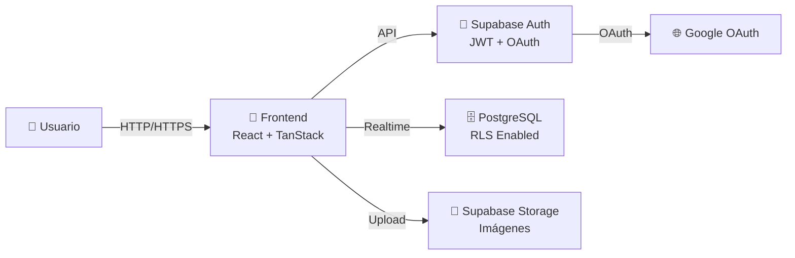

# Floristería Lucía - Tienda Online

Una tienda en línea moderna para floristería especializada en venta de flores, plantas y composiciones personalizadas en San Fernando de Henares, Madrid.

## Características

- 🌸 **Catálogo dinámico** - Productos organizados por categorías (ramos, plantas, rosas eternas, complementos, condolencias)
- 👤 **Autenticación segura** - Registro, login, Google OAuth mediante Supabase Auth
- 🛒 **Carrito de compras** - Gestión persistente de artículos en localStorage
- ❤️ **Favoritos** - Sistema de wishlist para usuarios
- 🌍 **Multiidioma** - Soporte para español, inglés y catalán
- 📦 **Gestión de envíos** - Información de cobertura y tarifas por localidad
- 🎨 **Diseño responsive** - Interfaz optimizada para móvil, tablet y desktop
- ♿ **Accesible** - Componentes WCAG accesibles con Radix UI
- 🔐 **Row Level Security** - Protección de datos de usuario en base de datos

## Tecnologías

| Tecnología               | Versión  | Uso                            |
| ------------------------ | -------- | ------------------------------ |
| **React**                | 19.2.0   | Framework UI                   |
| **TypeScript**           | 5.8.3    | Tipado estático                |
| **TanStack Start**       | 1.168.32 | Full-stack framework con SSR   |
| **TanStack Router**      | 1.170.18 | Enrutamiento                   |
| **TanStack React Query** | 5.101.1  | State management de datos      |
| **Supabase**             | 2.112.3  | BD PostgreSQL + Auth + Storage |
| **Tailwind CSS**         | 4.2.1    | Framework CSS                  |
| **Radix UI**             | Varios   | Componentes accesibles         |
| **React Hook Form**      | 7.71.2   | Gestión de formularios         |
| **Zod**                  | 3.24.2   | Validación de esquemas         |
| **Vite**                 | 8.2.0    | Build tool                     |

## Arquitectura



## Estructura del Proyecto

```
src/
├── routes/                 # Páginas (file-based routing)
│   ├── __root.tsx         # Layout raíz
│   ├── index.tsx          # Homepage
│   ├── auth.tsx           # Login/Signup
│   ├── catalogo.tsx       # Catálogo de productos
│   ├── carrito.tsx        # Carrito de compras
│   ├── contacto.tsx       # Contacto
│   ├── producto.$id.tsx   # Detalle de producto
│   ├── servicios.tsx      # Servicios especiales
│   └── _authenticated/    # Rutas protegidas
├── components/            # Componentes React
│   ├── ui/               # Componentes base (Radix UI)
│   └── [Componentes de negocio]
├── context/              # Global state (Context API)
│   ├── ShopContext.tsx   # Carrito y favoritos
│   ├── LanguageContext   # Multiidioma
│   └── ThemeContext.tsx  # Tema oscuro/claro
├── integrations/         # Integraciones externas
│   └── supabase/        # Cliente y middleware
├── data/                 # Datos estáticos
│   ├── catalog.ts       # Catálogo de productos
│   ├── services.ts      # Servicios personalizados
│   ├── company.ts       # Datos de la empresa
│   ├── coverage.ts      # Localidades de envío
│   ├── shipping.ts      # Tarifas de envío
│   └── [más datos]
├── hooks/                # Custom React hooks
│   └── useAuth.ts       # Estado de autenticación
├── lib/                  # Utilidades
│   └── utils.ts         # Funciones auxiliares
└── i18n/                 # Internacionalización
    └── ns/              # Namespaces de traducción
```

## Requisitos

- **Node.js** 18.x o superior (recomendado: 20.x)
- **npm** 9.x o superior (o yarn/pnpm/bun)
- **Cuenta Supabase** (gratuita en https://supabase.com)
- **Credenciales Google OAuth** (opcional, para login social)

## Instalación

### 1. Clonar repositorio

```bash
git clone <repository-url>
cd floristeria-lucia
```

### 2. Instalar dependencias

```bash
npm install
```

O con alternativas:

```bash
yarn install
pnpm install
bun install
```

### 3. Configurar variables de entorno

Copiar `.env.example` a `.env.local`:

```bash
cp .env.example .env.local
```

Rellenar con valores reales:

```env
VITE_SUPABASE_URL=https://your-project.supabase.co
VITE_SUPABASE_ANON_KEY=your-anon-key
VITE_GOOGLE_CLIENT_ID=your-google-client-id.apps.googleusercontent.com
```

**Obtener credenciales:**

- **Supabase**: Crear proyecto en https://supabase.com → Settings → API Keys
- **Google OAuth**: https://console.cloud.google.com/ → Create OAuth 2.0 credentials (Web Application)

### 4. Inicializar base de datos

Las migraciones se aplican automáticamente al usar Supabase. Verificar que las tablas existen en el dashboard de Supabase.

```bash
# Opcional: ejecutar seed si existe
npm run db:seed
```

## Desarrollo

### Iniciar servidor de desarrollo

```bash
npm run dev
```

El proyecto estará disponible en `http://localhost:5173`

**Características en desarrollo:**

- Hot Module Reloading (HMR)
- TypeScript type checking
- Vite development server optimizado
- Source maps para debugging

### Comandos disponibles

| Comando             | Descripción                   |
| ------------------- | ----------------------------- |
| `npm run dev`       | Inicia servidor de desarrollo |
| `npm run build`     | Build de producción           |
| `npm run build:dev` | Build en modo desarrollo      |
| `npm run preview`   | Previsualizar build           |
| `npm run lint`      | ESLint check                  |
| `npm run format`    | Prettier format               |

## Build para Producción

```bash
npm run build
```

Genera:

- `dist/` - Build de cliente (SPA)
- `.output/` - Build de servidor (SSR)

Tamaño aproximado: No determinado actualmente. Monitorear con `npm run build`.

## Deployment

### Opción 1: Vercel (Recomendado)

Vercel tiene soporte nativo para TanStack Start.

```bash
# Instalar Vercel CLI
npm install -g vercel

# Deploy
vercel
```

**Configuración requerida en Vercel:**

Variables de entorno en Vercel Dashboard → Settings → Environment Variables:

```
VITE_SUPABASE_URL=...
VITE_SUPABASE_ANON_KEY=...
VITE_GOOGLE_CLIENT_ID=...
```

### Opción 2: Railway

```bash
# Instalar Railway CLI
npm install -g @railway/cli

# Deploy
railway up
```

**Archivo railway.toml:**

```toml
[build]
builder = "nixpacks"

[deploy]
startCommand = "npm run start"
```

### Opción 3: Netlify

```bash
# Deploy con Netlify CLI
netlify deploy --prod
```

**Configuración en netlify.toml:**

```toml
[build]
command = "npm run build"
publish = "dist"
```

### Opción 4: Docker

```dockerfile
FROM node:20-alpine

WORKDIR /app

COPY package*.json ./
RUN npm ci

COPY . .

RUN npm run build

EXPOSE 3000

CMD ["npm", "start"]
```

```bash
docker build -t floristeria-lucia .
docker run -p 3000:3000 \
  -e VITE_SUPABASE_URL=... \
  -e VITE_SUPABASE_ANON_KEY=... \
  floristeria-lucia
```

## Base de Datos

### Tecnología

- **Motor**: PostgreSQL 14.15 (Supabase)
- **ORM**: Supabase SDK (consultas directas)
- **Seguridad**: Row Level Security (RLS)

### Tablas principales

| Tabla             | Descripción                         |
| ----------------- | ----------------------------------- |
| `auth.users`      | Usuarios (Supabase managed)         |
| `public.profiles` | Perfil extendido (nombre, teléfono) |
| `storage.objects` | Almacenamiento de imágenes          |

### Migraciones

Ubicadas en `supabase/migrations/`:

1. `20260822021251_*.sql` - Creación de tabla `profiles`
2. `20260822021259_*.sql` - Seguridad (revoke)
3. `20260823015431_*.sql` - Storage policies

Las migraciones se aplican automáticamente en Supabase. Para aplicar manualmente:

```bash
supabase db push
```

### Row Level Security (RLS)

Habilitado en tabla `profiles`:

- **SELECT**: Usuario solo puede leer su perfil
- **INSERT**: Usuario solo puede crear su perfil
- **UPDATE**: Usuario solo puede actualizar su perfil

Esto asegura que cada usuario solo acceda a sus datos.

## Autenticación

### Métodos soportados

1. **Email/Contraseña** - Login tradicional
2. **Google OAuth** - Login social

### Flujo de autenticación

```
Usuario (en /auth)
    ↓
Elige método de login
    ↓
Supabase Auth valida credenciales
    ↓
JWT token generado
    ↓
Token almacenado en localStorage
    ↓
Sesión activa en useAuth()
    ↓
Rutas protegidas accesibles
```

### Rutas protegidas

- `/mi-cuenta` - Perfil de usuario (requiere autenticación)

### Hook de autenticación

```typescript
const { user, session, loading } = useAuth();
```

## Carrito de Compras

### Persistencia

- Almacenamiento: `localStorage` (clave: `petalos-cart`)
- Estructura: Array de `CartLine` objects
- Sincronización: Automática en cada cambio

### CartLine

```typescript
type CartLine = {
  key: string; // productId::size
  productId: string;
  name: string;
  size: string;
  price: number;
  image: string;
  qty: number;
};
```

### Funciones

```typescript
// Usar carrito en componentes
const { lines, total, count, addLine, setQty, removeLine } = useShop();

// Agregar producto
addLine({ productId, name, size, price, image }, qty);

// Cambiar cantidad
setQty(key, newQty);

// Remover línea
removeLine(key);
```

**Nota**: El carrito persiste entre sesiones pero NO se sincroniza entre dispositivos (almacenamiento local).

## Pagos

**Estado**: No implementado actualmente.

El flujo esperado es:

1. Usuario revisa carrito
2. Contacta a floristería (WhatsApp, email, teléfono)
3. Floristería confirma pedido y método de pago
4. Cliente realiza pago (transferencia, tarjeta, PayPal)
5. Floristería prepara y entrega

**Para implementar pagos futuros**: Integrar Stripe o PayPal con validación de precios en servidor.

## APIs

### APIs Internas

No hay API REST propia actualmente. Todo se comunica directamente con Supabase:

```typescript
// Ejemplo: Actualizar perfil
const { error } = await supabase.from("profiles").upsert({ id, full_name, phone });
```

### APIs Externas

| API              | Uso               | Autenticación         |
| ---------------- | ----------------- | --------------------- |
| Supabase REST    | BD, Auth, Storage | API Key anónima + JWT |
| Google OAuth 2.0 | Login social      | Client ID             |

## Seguridad

### Variables de Entorno

**Públicas** (prefijo `VITE_`):

- Supabase URL (necesaria en cliente)
- Supabase ANON_KEY (acceso público limitado por RLS)
- Google Client ID

**Privadas** (nunca en frontend):

- Supabase SERVICE_ROLE_KEY (nunca exponer)
- API Keys secretas

### Prácticas de seguridad

1. **RLS Habilitado**: Control de acceso a nivel de BD
2. **JWT**: Tokens seguros para autenticación
3. **HTTPS**: Obligatorio en producción
4. **CORS**: Configurado en Supabase
5. **localStorage**: Tokens almacenados de forma segura

### Riesgos identificados

**Críticos:**

- Sin validación de precios en servidor (futura: implementar)
- Carrito sin persistencia en BD (futura: migrar a servidor)

**Altos:**

- Supabase ANON_KEY expuesta (mitigado por RLS)

Ver `SECURITY.md` para auditoría completa.

## Troubleshooting

### "Cannot find module '@tanstack/react-router'"

**Solución**: Instalar dependencias

```bash
npm install
```

### "SUPABASE_URL is not defined"

**Solución**: Verificar `.env.local`:

```bash
# Debe contener:
VITE_SUPABASE_URL=https://...
VITE_SUPABASE_ANON_KEY=...
```

### "RLS violation when fetching profile"

**Solución**: Verificar que:

1. Usuario está autenticado (`useAuth().user` no es null)
2. ID del usuario coincide con el ID en BD
3. RLS policies están correctas (revisar en Supabase)

### "Carrito se limpia al cambiar de dispositivo"

**Comportamiento esperado**: El carrito se almacena en localStorage local. Para sincronizar entre dispositivos, requeriría persistencia en BD (feature futura).

### "Google OAuth no funciona"

**Verificar:**

1. Google Client ID correcto en `.env.local`
2. Redirect URI registrado en Google Console: `http://localhost:5173` (dev), `https://dominio.com` (prod)
3. Supabase Auth con Google configurado

### "Build falla con errores de TypeScript"

**Solución:**

```bash
# Tipo check
npx tsc --noEmit

# Linting
npm run lint

# Arreglar automáticamente
npm run format
```

## Servicios Externos

| Servicio     | Necesario   | Configuración    |
| ------------ | ----------- | ---------------- |
| Supabase     | ✅ Sí       | URL + API Key    |
| Google OAuth | ⚠️ Opcional | Client ID        |
| Cloudflare   | ❌ No       | (potencial: CDN) |

**Si un servicio externo no está disponible:**

- Supabase: App no funciona
- Google OAuth: Login email/contraseña sigue disponible
- Email: No hay confirmaciones de email

## Variables de Entorno Completas

| Variable                 | Público/Privado | Uso             | Ejemplo                          |
| ------------------------ | --------------- | --------------- | -------------------------------- |
| `VITE_SUPABASE_URL`      | Público         | URL de Supabase | `https://xyz.supabase.co`        |
| `VITE_SUPABASE_ANON_KEY` | Público         | API anónima     | `eyJ...`                         |
| `VITE_GOOGLE_CLIENT_ID`  | Público         | OAuth de Google | `xyz.apps.googleusercontent.com` |
| `NODE_ENV`               | Local           | Entorno         | `development` / `production`     |

## Licencia

No determinado. Consultar con propietario del proyecto.

## Contacto

**Floristería Lucía**

- 📍 Calle de Motrico 9, 28830 San Fernando de Henares, Madrid
- 📞 919 95 38 80
- 📧 info@floristerialuciamotrico.com
- 💬 WhatsApp: +34919953880
- 📱 Instagram: @floristeria_lucia

## Documentación Adicional

- [ARCHITECTURE.md](./ARCHITECTURE.md) - Arquitectura técnica
- [DATABASE.md](./DATABASE.md) - Modelo de datos
- [SECURITY.md](./SECURITY.md) - Auditoría de seguridad
- [PROJECT_AUDIT_REPORT.md](./PROJECT_AUDIT_REPORT.md) - Auditoría completa

---

**Última actualización**: 2026-08-26  
**Versión**: 1.0  
**Estado**: Independiente de Lovable ✅
